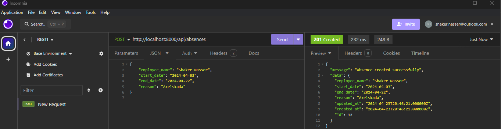

## Qurant- Work sample API

This repository contains a sample implementation of a RESTful API using Laravel for managing absence notifications to a payroll system.

**Prerequisites**
- PHP
- Composer
- Laravel CLI
- MySQL or SQLite database
- (Docker- devcontainer)

### Source

- For `api.php`:
  - [Stack Overflow - API route not found in Laravel](https://stackoverflow.com/questions/78195903/api-route-not-found-in-laravel)

- Inspiration:
  - [Building a RESTful API with Laravel: Best Practices and Tools](https://medium.com/@mukesh.ram/building-a-restful-api-with-laravel-best-practices-and-tools-907bdf4b5621)

### Documentation (Postman)

Explore and test the API using the provided Postman collection and documentation:

[Qurant-Sample API Documentation](https://documenter.getpostman.com/view/34481210/2sA3BrWpSL)

The API will be accessible at [http://localhost:8000](http://localhost:8000).

### Images 

  

### Previous Experience with Laravel

I have prior experience working with Laravel in a project where we developed an IMDb clone. In that project, I implemented features such as user authentication and authorization, including role-based access control (RBAC) to manage user permissions within the application.

[Imdb-clone-github](https://github.com/ShakerNasser/IMDB-Clone-U05.git)

